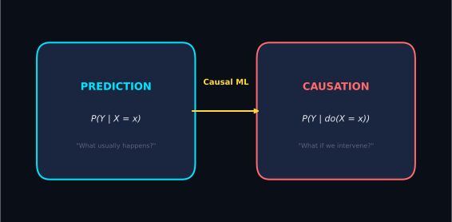
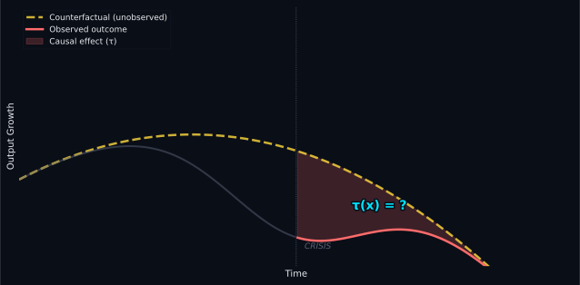
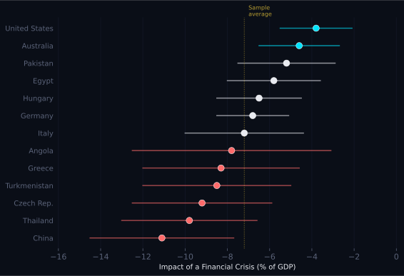
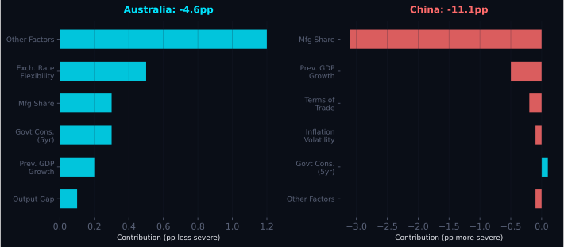
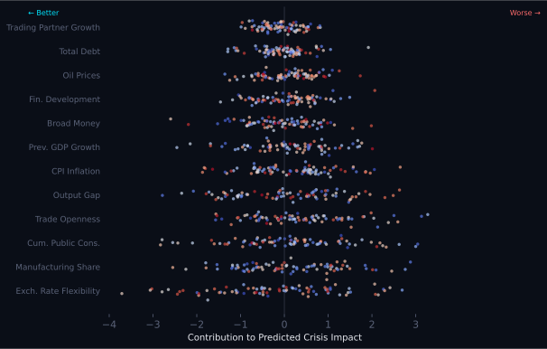
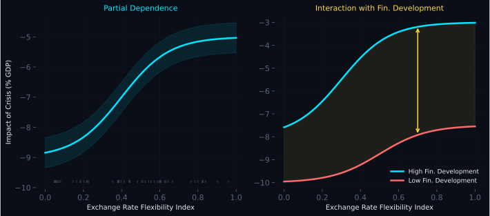
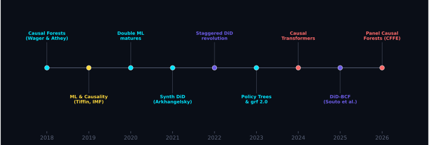

## {background-color="#0a0e17" .center}

::: {style="text-align: center; margin-top: 5px;"}
[MACHINE LEARNING]{style="font-size: 2em; font-weight: 200; letter-spacing: 0.3em; color: #00e5ff;"} [&]{style="font-size: 1.5em; font-weight: 200; color: #5a6278; margin: 0 15px;"} [CAUSALITY]{style="font-size: 2em; font-weight: 800; letter-spacing: 0.15em; color: #ff6b6b;"}

[The Impact of Financial Crises on Growth]{style="font-size: 0.95em; color: #5a6278; letter-spacing: 0.1em;"}

[--- and where the field has gone since]{style="font-size: 0.95em; color: #ffd93d; letter-spacing: 0.05em;"}

 

[Andrew Tiffin]{style="font-size: 0.85em; color: #e8eaf0; letter-spacing: 0.15em;"}

[IMF Working Paper 19/228 | Updated March 2026]{style="font-size: 0.65em; color: #5a6278;"}
:::

---

## {background-color="#0a0e17"}

::: {style="text-align: center; margin-top: 15px;"}
[*"The difficulty is to detach the framework of fact --- of absolute fact ---*]{style="font-size: 1.3em; color: #5a6278; font-style: italic;"}

[*from the embellishments of theorists..."*]{style="font-size: 1.3em; color: #5a6278; font-style: italic;"}

 

[--- The Memoirs of Sherlock Holmes]{style="font-size: 0.9em; color: #ffd93d;"}
:::

---

## The Core Tension {background-color="#0a0e17"}

{fig-align="center" width="80%"}

::: {.fragment style="text-align: center; color: #5a6278; font-size: 0.85em;"}
A crowing rooster is a good **predictor** of sunrise. But intervening on the rooster won't stop the sun from rising.
:::

---

## We Never See the Path Not Taken {background-color="#0a0e17"}

{fig-align="center" width="85%"}

::: {style="text-align: center;"}
[The **fundamental problem** of causal inference: we observe one outcome per unit.]{style="color: #5a6278; font-size: 0.8em;"}

[Counterfactual predictions can never be validated --- we need them to be **plausible**.]{style="color: #e8eaf0; font-size: 0.8em;"}
:::

---

## Why ML Changes the Game {background-color="#0a0e17"}

::: {.columns}
::: {.column width="33%"}
::: {style="background: #131926; padding: 15px; border-radius: 10px; border-left: 3px solid #00e5ff;"}
[CONFOUNDER SELECTION]{style="font-size: 0.65em; letter-spacing: 0.15em; color: #00e5ff;"}

LASSO selects which controls matter from hundreds of candidates. Double selection (Belloni et al., 2014) selects on **both** outcome and treatment.
:::
:::

::: {.column width="33%"}
::: {style="background: #131926; padding: 15px; border-radius: 10px; border-left: 3px solid #ffd93d;"}
[COUNTERFACTUAL QUALITY]{style="font-size: 0.65em; letter-spacing: 0.15em; color: #ffd93d;"}

ML propensity scores build better matches between treated and control groups. Better E[Y|X] directly improves counterfactual estimates.
:::
:::

::: {.column width="33%"}
::: {style="background: #131926; padding: 15px; border-radius: 10px; border-left: 3px solid #ff6b6b;"}
[HETEROGENEOUS EFFECTS]{style="font-size: 0.65em; letter-spacing: 0.15em; color: #ff6b6b;"}

**Causal Forests** find who benefits and who is harmed --- nonparametrically. No need to pre-specify interactions or functional forms.
:::
:::
:::

---

## The Average Hides Everything {background-color="#0a0e17"}

::: {.columns}
::: {.column width="50%"}
::: {style="background: #131926; padding: 15px; border-radius: 10px; border-top: 3px solid #ffd93d;"}
[THE OLD QUESTION]{style="font-size: 0.65em; letter-spacing: 0.15em; color: #ffd93d;"}

*"Does the drug work?"*

One number for everyone. A single average treatment effect.

If the drug helps some patients and harms others, the average may be **zero** --- and we'd conclude it doesn't work.
:::
:::

::: {.column width="50%"}
::: {style="background: #131926; padding: 15px; border-radius: 10px; border-top: 3px solid #00e5ff;"}
[THE NEW QUESTION]{style="font-size: 0.65em; letter-spacing: 0.15em; color: #00e5ff;"}

*"For whom does it work, and why?"*

A **personalised** effect for each patient --- based on their characteristics.

We want to know: young patients benefit, elderly patients don't. **That's the signal.**
:::
:::
:::

::: {.fragment style="text-align: center; margin-top: 8px;"}
[A **causal forest** is a machine that answers the new question.]{style="color: #e8eaf0; font-size: 0.9em;"}
:::

---

## How a Causal Forest Thinks {background-color="#0a0e17"}

::: {style="margin-top: 5px;"}
Imagine sorting patients into groups where the drug's effect is most **different**:

::: {.fragment}
[1.]{style="font-size: 1.2em; color: #00e5ff; font-weight: 800; margin-right: 8px;"} **Split** the data: find the characteristic that best separates *who benefits* from *who doesn't* --- age? income? blood pressure? The algorithm searches, you don't have to guess.
:::

::: {.fragment}
[2.]{style="font-size: 1.2em; color: #ffd93d; font-weight: 800; margin-right: 8px;"} **Keep splitting** to maximise the difference in treatment effects **between** groups. Each final leaf contains similar people --- a mini-experiment with its own effect estimate.
:::

::: {.fragment}
[3.]{style="font-size: 1.2em; color: #ff6b6b; font-weight: 800; margin-right: 8px;"} **Repeat** hundreds of times with random subsets of data and variables. Average across all trees. The forest is **robust** where any single tree is fragile.
:::

::: {.fragment}
[4.]{style="font-size: 1.2em; color: #6c5ce7; font-weight: 800; margin-right: 8px;"} **Honesty trick**: one half of the data decides *where to split*; the other half *measures the effect*. This prevents overfitting and gives valid confidence intervals.
:::
:::

---

## The Formal Idea {background-color="#0a0e17"}

::: {.columns}
::: {.column width="55%"}
::: {style="background: #131926; padding: 15px; border-radius: 10px;"}
$$Y_i = \tau_{(i)} W_i + X_i \beta + \varepsilon_i$$

[where $\tau_{(i)}$ is the treatment effect for unit $i$ --- and it **varies**]{style="color: #5a6278; font-size: 0.8em;"}
:::

::: {style="margin-top: 10px;"}
[**Standard regression**: you choose the interactions]{style="color: #ff6b6b; font-size: 0.85em;"}

[**Causal forest**: the algorithm finds them]{style="color: #00e5ff; font-size: 0.85em;"}
:::
:::

::: {.column width="45%"}
::: {style="background: #131926; padding: 15px; border-radius: 10px;"}
[KEY PROPERTIES]{style="font-size: 0.65em; letter-spacing: 0.15em; color: #ffd93d;"}

Splits maximise **heterogeneity of effects** between groups --- not prediction accuracy.

Each leaf is a neighbourhood of **similar people**, yielding a local treatment effect with a valid confidence interval.

No functional form assumed.
:::
:::
:::

---

## {background-color="#0a0e17" .center}

::: {style="text-align: center; margin-top: 10px;"}
[APPLICATION]{style="font-size: 0.75em; letter-spacing: 0.3em; color: #5a6278;"}

[What is the cost of a]{style="font-size: 1.6em; color: #e8eaf0;"}

[financial crisis?]{style="font-size: 1.9em; color: #ff6b6b; font-weight: 800;"}

 

[107 countries | 46 variables | 1985--2017]{style="font-size: 0.85em; color: #5a6278; letter-spacing: 0.05em;"}
:::

---

## Risk vs. Vulnerability {background-color="#0a0e17"}

::: {.columns}
::: {.column width="50%"}
::: {style="background: #131926; padding: 15px; border-radius: 10px; border-top: 3px solid #ff6b6b;"}
[RISK]{style="font-size: 1.1em; color: #ff6b6b; font-weight: bold;"}

The probability that a crisis occurs. Most EWS models focus here. *Will the storm hit?*
:::
:::

::: {.column width="50%"}
::: {style="background: #131926; padding: 15px; border-radius: 10px; border-top: 3px solid #00e5ff;"}
[VULNERABILITY]{style="font-size: 1.1em; color: #00e5ff; font-weight: bold;"}

The cost of a crisis, **if** it occurs. This paper focuses here. *How sturdy is the house?*
:::
:::
:::

::: {.fragment style="text-align: center; margin-top: 5px;"}
[Two houses on the Florida seaboard face the same **risk**. A concrete house is less **vulnerable** than a wooden one.]{style="color: #ffd93d; font-size: 0.85em;"}
:::

---

## The Cost Varies Enormously {background-color="#0a0e17"}

{fig-align="center" width="75%"}

::: {style="text-align: center;"}
[Sample average: **-7.2 pp** of GDP over two years]{style="color: #ffd93d; font-size: 0.9em;"}

[But ranges from **-3.8** (United States) to **-11.1** (China)]{style="color: #5a6278; font-size: 0.85em;"}
:::

---

## Decomposing the Black Box {background-color="#0a0e17"}

{fig-align="center" width="90%"}

::: {style="text-align: center; margin-top: 5px;"}
[Shapley values decompose each prediction into variable contributions]{style="color: #5a6278; font-size: 0.85em;"}

[Australia: flexible exchange rate **buffers**. China: manufacturing share **amplifies**.]{style="color: #e8eaf0; font-size: 0.85em;"}
:::

---

## What Matters Most? {background-color="#0a0e17"}

{fig-align="center" width="85%"}

::: {style="text-align: center;"}
[**Exchange rate flexibility** is the single most important moderator]{style="color: #00e5ff; font-size: 0.9em;"}

[Variables are ranked by mean |Shapley value| --- wider spread = more important]{style="color: #5a6278; font-size: 0.8em;"}
:::

---

## The Exchange Rate Story {background-color="#0a0e17"}

{fig-align="center" width="90%"}

::: {style="text-align: center; margin-top: 5px;"}
[Flexibility reduces crisis cost --- but **only for financially developed countries**]{style="color: #ffd93d; font-size: 0.9em;"}

[The interaction is **nonlinear** --- undetectable by standard regression]{style="color: #5a6278; font-size: 0.85em;"}
:::

---

## {background-color="#0a0e17" .center}

::: {style="text-align: center; margin-top: 10px;"}
[SIX YEARS LATER]{style="font-size: 0.75em; letter-spacing: 0.3em; color: #5a6278;"}

[Where has the]{style="font-size: 1.6em; color: #e8eaf0;"}

[field gone?]{style="font-size: 1.9em; color: #6c5ce7; font-weight: 800;"}
:::

---

## The Causal ML Frontier {background-color="#0a0e17"}

{fig-align="center" width="95%"}

::: {style="text-align: center; margin-top: 5px;"}
[From estimating **average** effects to estimating **who is affected and why**]{style="color: #e8eaf0; font-size: 0.85em;"}
:::

---

## The New Toolkit {background-color="#0a0e17"}

::: {.columns}
::: {.column width="50%"}
::: {style="background: #131926; padding: 12px; border-radius: 10px; border-left: 3px solid #6c5ce7; margin-bottom: 8px;"}
[DOUBLE / DEBIASED ML]{style="font-size: 0.65em; letter-spacing: 0.1em; color: #6c5ce7;"} — Chernozhukov et al. (2018)

ML for nuisance parameters + semiparametric efficiency. Clean ATEs in high dimensions.
:::

::: {style="background: #131926; padding: 12px; border-radius: 10px; border-left: 3px solid #00e5ff;"}
[PANEL CAUSAL FORESTS]{style="font-size: 0.65em; letter-spacing: 0.1em; color: #00e5ff;"} — CFFE (Aytug et al., 2026)

Node-level residualisation of fixed effects. HTEs from panel data with staggered treatment.
:::
:::

::: {.column width="50%"}
::: {style="background: #131926; padding: 12px; border-radius: 10px; border-left: 3px solid #ffd93d; margin-bottom: 8px;"}
[STAGGERED DiD + ML]{style="font-size: 0.65em; letter-spacing: 0.1em; color: #ffd93d;"} — DiD-BCF (Souto et al., 2025)

Bayesian causal forests with parallel trends. Full posterior on CATEs.
:::

::: {style="background: #131926; padding: 12px; border-radius: 10px; border-left: 3px solid #ff6b6b;"}
[CAUSAL TRANSFORMERS]{style="font-size: 0.65em; letter-spacing: 0.1em; color: #ff6b6b;"} — ICML 2026

Cross-attention for long-range confounders. Counterfactuals over time series.
:::
:::
:::

---

## What This Paper Would Look Like Today {background-color="#0a0e17"}

| 2019 Approach | 2026 Approach |
|:---|:---|
| Cross-sectional causal forest | **Panel causal forest (CFFE)** with unit + time FE |
| SMOTE for class imbalance | **Honest subsampling** with staggered treatment timing |
| Shapley values for interpretation | **SHAP + causal mediation** via DAG-structured decomposition |
| Single treatment (crisis dummy) | **Continuous treatment** (crisis severity) via instrumental forests |
| Post-hoc interaction exploration | **Policy trees** for optimal intervention assignment |

::: {.fragment style="text-align: center; margin-top: 10px;"}
[The core insight --- **heterogeneous vulnerability** --- is more relevant than ever]{style="color: #ffd93d; font-size: 0.85em;"}
:::

---

## The Macro Gap {background-color="#0a0e17"}

Causal forests have been applied extensively in:

::: {style="color: #00e5ff;"}
- Labor economics (job training RCTs, wage effects)
- Development economics (education outcomes)
- Health (treatment heterogeneity)
:::

::: {.fragment}
But **barely touched** in:

::: {style="color: #ff6b6b;"}
- Macroeconomic growth
- Trade and industrial policy
- Monetary and fiscal policy transmission
- Resource wealth and TFP
:::
:::

::: {.fragment style="text-align: center; margin-top: 8px;"}
[**The 2019 crisis paper remains one of very few macro applications.**]{style="color: #ffd93d; font-size: 0.85em;"}
:::

---

## {background-color="#0a0e17" .center}

::: {style="text-align: center; margin-top: 15px;"}
[KEY TAKEAWAYS]{style="font-size: 0.75em; letter-spacing: 0.3em; color: #5a6278;"}

[1.]{style="font-size: 1.5em; color: #00e5ff; font-weight: 800; margin-right: 10px;"} [Averages hide everything]{style="font-size: 1.1em; color: #e8eaf0;"}

[2.]{style="font-size: 1.5em; color: #ffd93d; font-weight: 800; margin-right: 10px;"} [Nonlinearities and interactions are the signal, not the noise]{style="font-size: 1.1em; color: #e8eaf0;"}

[3.]{style="font-size: 1.5em; color: #ff6b6b; font-weight: 800; margin-right: 10px;"} [The frontier has moved --- but macro hasn't caught up]{style="font-size: 1.1em; color: #e8eaf0;"}

[4.]{style="font-size: 1.5em; color: #6c5ce7; font-weight: 800; margin-right: 10px;"} [Panel causal forests are ready for cross-country questions]{style="font-size: 1.1em; color: #e8eaf0;"}
:::

---

## {background-color="#0a0e17" .center}

::: {style="text-align: center; margin-top: 10px;"}
[*"More has been learned about causal inference in the last few decades*]{style="font-size: 1.05em; color: #5a6278; font-style: italic;"}

[*than the sum total of everything that had been learned about it*]{style="font-size: 1.05em; color: #5a6278; font-style: italic;"}

[*in all prior recorded history."*]{style="font-size: 1.05em; color: #5a6278; font-style: italic;"}

[--- Gary King, 2007]{style="font-size: 0.85em; color: #ffd93d;"}

 

[The tools exist. The macro questions are waiting.]{style="font-size: 1em; color: #00e5ff;"}
:::
